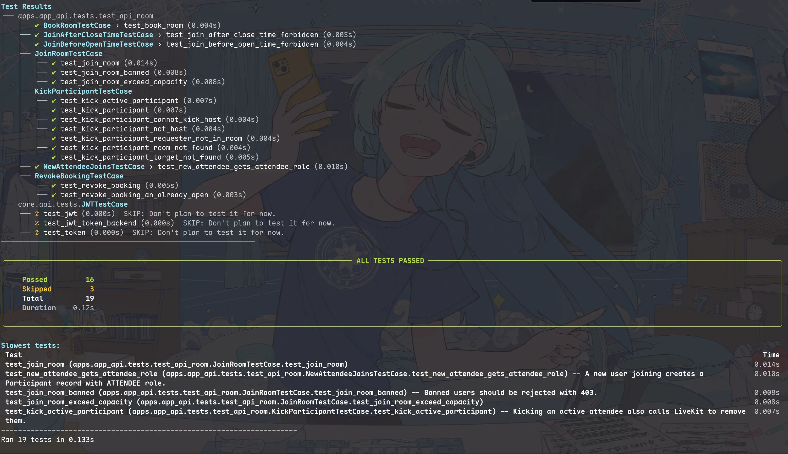

# django-prismtest

A modern, colorful Django test runner with real-time spinners, syntax-highlighted output, and beautifully formatted test results.

Screenshot (Can be outdated; But the newer versions should come with better UI):


## Features

- Real-time Braille-dot spinner while each test runs
- Colored pass/fail/error/skip indicators with Unicode icons
- Per-test timing and "slowest tests" report
- Rich-formatted summary panel with pass/fail counts
- Syntax-highlighted tracebacks with project-code emphasis
- Drop-in replacement for Django's `DiscoverRunner`
- Respects Django's `--debug-sql` and `--pdb` flags

## Requirements

- Python 3.10+
- Django 4.2+
- Rich 13.0+

## Installation

```bash
pip install django-prismtest
```

Or with uv:

```bash
uv add django-prismtest
```

## Quick start

Add to your Django settings:

```python
TEST_RUNNER = "django_prismtest.runner.PrismDiscoverRunner"
```

Then run tests as usual:

```bash
python manage.py test
```

## Configuration

### Verbosity levels

django-prismtest follows Django's built-in `--verbosity` flag:

| Level | Flag | Behavior |
|-------|------|----------|
| 2 (default) | `-v 2` | Per-test results with spinner, icons, and timing |
| 1 | `-v 1` | Dot-style progress (`....FE..s`) |
| 0 | `-v 0` | Summary only |

### `PRISMTEST_HIGHLIGHT_PATH`

Set this in your Django settings to highlight your project's code in tracebacks:

```python
PRISMTEST_HIGHLIGHT_PATH = "/path/to/your/project/"
```

Lines from this path will appear in bold yellow, making it easy to spot your code in stack traces.

## Development

```bash
# Install dependencies
uv sync --group dev

# Run tests
uv run python -m pytest tests/

# Run the visual demo
uv run python main.py
```

## License

MIT
